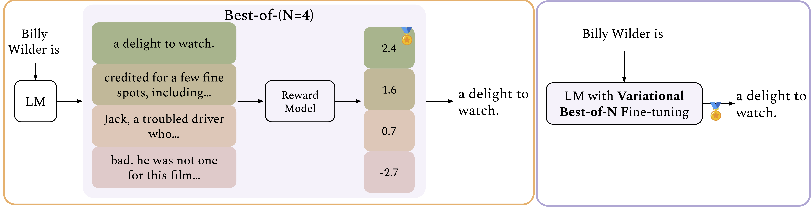

# Variational Best-of-N Alignment

<p align="center">
  
</p>

> :warning: This repository is based on the [trlx library](https://github.com/CarperAI/trlx/tree/main). Please refer to the original repository for general installation guidelines. We thank the authors for releasing this library.

## Requirements
Make sure to follow the instructions in [trlx library](https://github.com/CarperAI/trlx/tree/main) to install the required packages. Importantly, `trlx` relies on an older version of transformers, so make sure that the version of the transformers library is `==4.32.0`. 

## Sentiment Control Task

### Data

To train using the `vBoN` objective, we need to cache the distribution of reward values under the reference model for each prompt in the dataset. The training and testing processes rely on two files: `imdb-train-bon-vllm.jsonl` and `imdb-test-bon-vllm.jsonl`. While caching the reward distribution for the test set is not strictly necessary, it is included to compute win rates by providing reward values for responses sampled from the reference policy.

#### Data Preparation

To create these files:
1. Sample $M$ responses per prompt from your chosen reference model.
2. Compute the rewards for these responses using the reward model.

Each line in the `.jsonl` file contains a prompt, a response, and the corresponding reward value. For example:

```json
{"prompt": "okay, my", "text": "okay, my only positive thing is she lives for unknown reasons.", "reward": -1.0519390106201172}
```

The code then aggregates all responses for a given prompt and estimates the cumulative distribution function (CDF) of rewards.

### Training

The training script for `vBoN` on the sentiment control task is located in `examples/ppo_sentiment.py`. Originally, the `trlx` library supported only RLHF-PPO training. We have modified it to allow both conventional RLHF training with PPO and `vBoN` training, which is also performed using PPO.

#### Running Training

Use the following command to start `vBoN` training:

```bash
python examples/ppo_sentiment.py \
        --init_kl_coef 0.1 \
        --seed 0 \
        --no-curvefit \
        --bon_dict_path [DATA_PATH] \
        --bon \
        --bound exact
```

**Command Options:**
- `--init_kl_coef`: Represents `beta` in the RLHF objective. According to the paper, `n = 1/beta + 1`, so we set `init_kl_coef` accordingly.
- `--no-curvefit`: Disables smoothing of the estimated CDF using curve fitting. Since it did not yield significant improvements, this is the default setting.
- `--bon_dict_path`: Specifies the path to the dataset containing the precomputed reward distributions for training and evaluation.
- `--no-bon`: Use this option to train with the RLHF objective instead of `vBoN`.
- `--bound`: Defines the type of bound used in the `vBoN` objective. The default is `exact`, but `l1` is another useful alternative.

## Summarization Task

### Data

As with the sentiment control task, `vBoN` training for summarization requires precomputing and storing the reward distributions. However, this task uses a more space-efficient storage format. The training script relies on the `tldr-sftent-train.jsonl` file.

Unlike the previous task, evaluation here is handled by a separate script, as we do not assume access to an oracle reward model. Therefore, reward values for test prompts are not cached.

#### Data Preparation

To generate `tldr-sftent-train.jsonl`:
1. Sample $M$ responses per prompt from a reference model (e.g., Pythia 2.8B).
2. Compute the rewards for these responses.

Each line in the `.jsonl` file consists of a prompt, an optional list of $M$ responses, and a corresponding list of $M$ reward values. Example (for $M=3$):

```json
{"prompt": "SUBREDDIT: r/relationships\nTITLE:TITLE.\nPOST: POST\nTL;DR:", "responses": ["RESPONSE1", "RESPONSE2", "RESPONSE3"], "rewards": [1.28125, 2.138671875, 2.29296875]}
```

Providing text responses is optional (useful for debugging), but the script only relies on reward values to compute the CDF.

### Training

Navigate to `examples/summarize_rlhf/` and run the following command:

```bash
accelerate launch --config_file configs/default_accelerate_config.yaml trlx_pythia_summarization.py \
--bon \
--bon_dict_path [DATA_PATH] \
--models_path [MODELS_PATH]
```

**Command Options:**
- `--bon`: Enables training with the variational best-of-N objective. Use `--no-bon` to train with the RLHF objective instead.
- `--bon_dict_path`: Specifies the path to the dataset containing the precomputed reward distributions.
- `--models_path`: Specifies the location of the Pythia reference model and the reward model. If using different models, update the script accordingly.

## Citation
If you found this code useful, please consider citing our work:
```
@inproceedings{
amini2025variational,
title={Variational Best-of-N Alignment},
author={Afra Amini and Tim Vieira and Elliott Ash and Ryan Cotterell},
booktitle={The Thirteenth International Conference on Learning Representations},
year={2025},
url={https://openreview.net/forum?id=W9FZEQj3vv}
}
```

